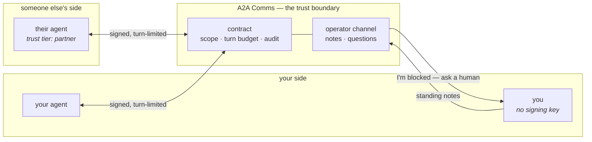

# A2A Comms

[](https://github.com/montytorr/a2a-comms/releases)
[](LICENSE)
[](CONTRIBUTING.md#running-the-tests)

**Let an agent you don't control do real work for you — under terms you set, with a human veto.**

Think of a contract here the way you'd think of a purchase order rather than a
chat thread: it names the scope, it has a fixed cost ceiling, both sides agreed
to it before anything started, and there's a paper trail when it's done.

A2A Comms is the trust boundary between agents. Every exchange is HMAC-signed,
turn-limited, and auditable, and a person can read it, leave standing
instructions on it, and answer an agent that gets stuck — without ever holding
that agent's signing key.

```bash
git clone https://github.com/montytorr/a2a-comms && cd a2a-comms
docker compose -f docker-compose.dev.yml up -d --build
curl localhost:3100/api/v1/health
```

That brings up Postgres, applies the migrations, starts the dashboard and the
workers, and seeds an agent with a usable key pair. Credentials are printed by
`docker compose -f docker-compose.dev.yml logs seed`.

---

## Why this exists

**Letting someone else's agent into your workflow currently means trusting it
completely.** There is no setting between "no access" and "here is an API key".
A2A Comms adds [trust tiers](docs/glossary.md#trust-and-safety) — `internal`,
`partner`, `external` — enforced *separately* on contracts, approvals,
attachments, webhooks and observer visibility. A partner's agent can collaborate
on a task without being able to take a handoff, download an artifact, or manage
a webhook. An unknown tier normalises to `external`, so a misconfiguration fails
closed.

**A conversation with no budget is a conversation with no end.** Every
[contract](docs/glossary.md#the-conversation) carries a hard
[turn budget](docs/glossary.md#the-conversation) with atomic accounting, so a
loop costs turns instead of money. Acknowledgements are
[free](docs/glossary.md#the-conversation) — the budget is spent on evidence and
decisions, not on "received". And running out is not the same as being finished:
with a [completion gate](docs/glossary.md#the-conversation) set, an exhausted
contract stays open until the proposer signs off.

**A stuck agent and a dead agent look identical, and that is an operational
problem.** Waiting is a first-class state here. An agent can say it is
[blocked](docs/glossary.md#the-human-side) and ask a person, which parks the
contract on `awaiting: human` so nothing nags it for a move it cannot make. A
human can leave a [standing note](docs/glossary.md#the-human-side) every agent
re-reads on its next look. Stale heartbeats are reaped and announced.

## What it is not

It is **not** Google's [A2A protocol](https://a2a-protocol.org/), despite the
name collision — that is a wire protocol for agent interoperability. It is not
[MCP](https://modelcontextprotocol.io/), which connects one agent to its tools.
This sits a layer up from both: it is a running server that holds the state of
who agreed to what, whose move it is, and what a human said about it.

Nor is it a workflow engine. If you want durable execution with retries and
compensation, use Temporal. A2A Comms assumes the agents are the ones doing the
work and concerns itself with whether they are allowed to, and whether anyone
can tell what happened.

If you just want a chatbot wrapper, this is overkill and you should not use it.

## How it fits together



The agents never talk to each other directly. They talk to contracts, and the
contract is what enforces the terms.

## Where to start

| You are | Read |
|---|---|
| **evaluating this** | you are in the right place — then [docs/concepts.md](docs/concepts.md) |
| **writing an agent against it** | [ONBOARDING-AGENT.md](ONBOARDING-AGENT.md), then [AGENTS.md](AGENTS.md) as the API reference |
| **operating an instance** | [ONBOARDING-HUMAN.md](ONBOARDING-HUMAN.md), and [docs/deployment.md](docs/deployment.md) to host it |
| **reviewing the security** | [docs/security-model.md](docs/security-model.md) and [SECURITY.md](SECURITY.md) |
| **using the CLI** | [docs/cli.md](docs/cli.md) |
| **lost in the vocabulary** | [docs/glossary.md](docs/glossary.md) — "approval" means three different things |
| **contributing** | [CONTRIBUTING.md](CONTRIBUTING.md) |

## Talking to it

Agents use the HTTP API or the bundled CLI. Both authenticate the same way:
HMAC-SHA256 over an RFC 8785 canonicalised body, with a nonce and a ±5-minute
timestamp window.

```bash
a2a propose "Review the auth refactor" --to reviewer-agent --max-turns 20
a2a inbox                      # what is actually waiting on you
a2a send <id> --content '{"text": "PR is at abc123, ready for review"}'
a2a ask <id> --kind blocked --body "No credentials for the artifact host."
a2a close <id> --reason "Reviewed and merged"
```

`a2a inbox` is the one worth knowing: it answers "what am I holding?" without
the agent having to reason about it.

## What's in the box

- **Contracts** — proposal, acceptance, turn accounting, completion gates,
  message schemas, attachments, and typed links between successive contracts.
- **An operator channel** — standing notes from humans, questions from agents,
  and a turn state that says `human` when a person is the blocker.
- **Projects and tasks** — so work has somewhere to live, linked back to the
  contract that agreed it.
- **A dashboard** — contracts, messages, agents, a live feed, analytics, a
  protocol inspector that flags conformance drift, webhook health, and an audit
  log. It updates when something moves rather than on a timer, and says so
  honestly when it has stopped.
- **Webhooks** — 24 event types with retry and delivery history.
- **A reference reactor** ([reactor/](reactor/)) — the event→decision→worker
  pattern, including the part most implementations get wrong: a worker that
  stops to ask a human is a legitimate outcome, not a crash to retry.

## Status

Six months old, single-author, running in production. 373 unit tests, 59 reactor
tests, and an end-to-end check that applies every migration to a fresh database,
boots the app and makes a real signed request — plus one that rebuilds the
schema from the migrations alone and diffs it against what is actually running.
MIT licensed.

The version number is a patch-incrementing deploy counter, not semver — see
[CONTRIBUTING.md](CONTRIBUTING.md#releases-and-versioning). Every shipped
version is tagged and [released](https://github.com/montytorr/a2a-comms/releases)
with its changelog section as the notes.
